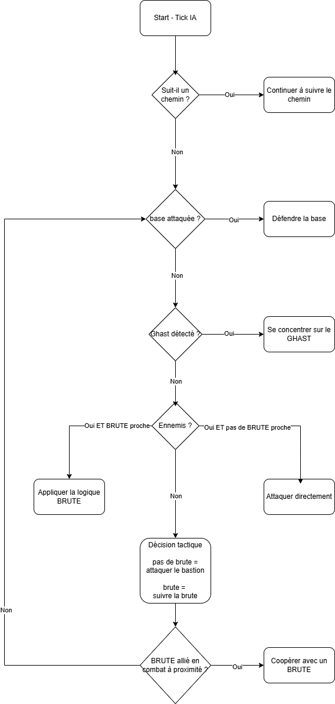

# Rapport technique — IA CROSSBOWMAN

Date : 26-10-2025

## Vidéo de démonstration

Vous pouvez visionner une démonstration de l'IA ici : [Démonstration IA CROSSBOWMAN](https://youtu.be/wRPA4KuI9Ro)

## 1) Identité et contexte

- Auteur  : Lorenzo Vandenkoornhuyse
- Jeu : **Clash‑of‑piglin**
- Unité ciblée : **CROSSBOWMAN** (IA pour l'équipe ennemie)

> Ce document décrit où se trouve le code, la stratégie appliquée et les algorithmes utilisés pour l'IA des Crossbowmen.

## 2) Emplacement du code (branche)

- Branche Git contenant les modifications : `IA_VANDENKOORNHUYSE`

Fichiers principaux modifiés :

- `src/systems/crossbowman_ai_system_enemy.py` — logique principale de l'IA (process, décision tactique, support BRUTE, group assault, défenses).
- `src/components/ai.py` — composant `AIMemory`.
- `src/systems/ai_helpers.py` — helpers pour la coordination BRUTE, gestion de bastion, priorisation et mouvements.
- `src/events/event_move.py` / `src/events/event_move_to.py` — événements de mouvement utilisés (`EventMoveTo`).
- `src/systems/pathfinding_system.py` il utilise `PathRequest` (A*).
- `config.yaml` — configurations générales; options debug (ex. `debug.give_gold.*`).
- `src/systems/economy_system.py`, `src/systems/input_manager.py`, `src/systems/input_router_system.py` — intégration du raccourci debug (donner de l'or avec "g" ou "f3" pour voir le calcul des chemins et les blocs de collisions en rouge).

Point d'entrée pour tests locaux : `src/main.py`.

## 3) Stratégie mise en œuvre (diagramme)

## 4) Algorithmes et considérations techniques

- Pathfinding : A* (implémenté par le `PathfindingSystem` via le composant `PathRequest`).
  - L'IA vérifie d'abord si la trajectoire directe est sûre (`_is_direct_path_safe`). Si non sûre (ex : lave), elle crée/actualise un `PathRequest` pour que le `PathfindingSystem` calcule un chemin A*.

  - Estimation de force locale : points attribués aux unités (BRUTE=3, CROSSBOWMAN=5, GHAST=8). Somme des points pour alliés et ennemis dans un rayon donné -> comparaison.
  - Branching logique (voir diagramme) : GHAST > BRUTE support > base defense > force-based decisions.

- Group tactics / recrutement : approche gloutonne locale :
  - Recrutement d'alliés dans un rayon `RECRUIT_RADIUS` (ex. 500 px).
  - Placement en formation circulaire autour de la cible à `safe_distance` calculée depuis `attack.range`.

- BRUTE assignment :
  - Chaque tick, on initialise `_brute_assignment_counts` à partir des `AIMemory` existants et on incrémente lorsque l'on réserve une BRUTE.
  - `AIMemory.assigned_brute_id` permet de maintenir l'affectation entre ticks pour empêcher des réaffectations inutiles.

- Mouvements :
  - Mouvement direct via `EventMoveTo` si le chemin direct est sûr.
  - Sinon, création d'un `PathRequest` pour déclencher l'A*.

## 5) Suggestions d'améliorations futures

- Ajuster les poids du système de force (BRUTE/CROSSBOWMAN/GHAST) via configuration plutôt que constantes codées en dur.
- Ajouter des tests automatisés (unitaires) pour les fonctions pures : calcul de force, sélection de BRUTE, placement d'assaut.

