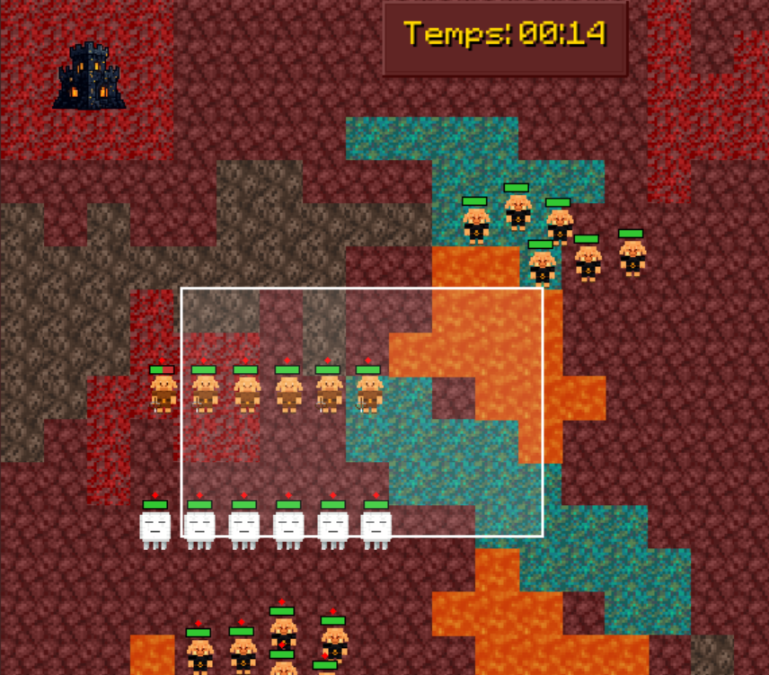

# ⚔️ Clash of piglin
### Un RTS inspiré du Nether de *Minecraft*

---

## 🧭 Introduction

Bienvenue dans **Clash of piglin**, un **jeu de stratégie en temps réel** où deux armées s’affrontent dans les profondeurs du Nether.  
Chaque joueur doit gérer ses troupes de Piglins et de Ghasts pour **anéantir le bastion ennemi** situé à l’extrémité opposée de la carte.

Le jeu combine **gestion tactique**, **contrôle direct des unités** et **progression économique**.  
Votre réussite dépendra de votre sens de la stratégie et de votre capacité à exploiter les particularités du terrain du Nether.

---

## 🎯 Objectif

> **Détruisez le bastion ennemi avant que le vôtre ne tombe.**

Chaque joueur défend un bastion :  
- Si votre bastion est détruit → vous perdez.  
- Si vous détruisez celui de l’adversaire → vous remportez la partie.

---

## 🧱 Interface du jeu

L’interface de **Clash of piglin** est divisée en plusieurs sections :

| Zone | Description |
|------|--------------|
| **Zone centrale** | Champ de bataille où évoluent vos troupes |
| **Barre latérale gauche** | Indique vos ressources et la vie de votre bastion et permet l'achat des unités pour le **joueur 1**|
| **Barre latérale droite** | Indique vos ressources et la vie de votre bastion et permet l'achat des unités pour le **joueur 2** |
| **Timer** | Indique le temps depuis le début de la partie |

### 🪙 Ressources
Votre **revenu d’or** augmente automatiquement avec le temps :

| Temps écoulé (minutes) | Revenu par seconde |
|-------------------------|------------------|
| 0:00 → 1:00 | +0.13 |
| 1:00 → 2:00 | +0.16 |
| 2:00 → 3:00 | +0.20 |
| 3:00 → 4:00 | +0.25 |
| 4:00 | +0.30 |

> 💡 Le revenu est cumulé automatiquement. Plus la partie avance, plus votre économie devient puissante.

Vous pourrez obtenir sur les unités adverses vaincus des récompenses correspondant à 10% du coût de l'unité

---

## 🪖 Les unités

| Unité | Image | Type | Cibles | Rôle principal |
|--------|--------|-------|----------|----------------|
| **Piglin Brute** |  | Corps à corps | Troupes terrestres | Attaquant puissant de première ligne |
| **Piglin Arbalétrier** |  | Distance | Troupes terrestres et aériennes | Soutien à moyenne portée |
| **Ghast** |  | Aérien | Bâtiments uniquement | Bombardement du bastion ennemi |

### 💥 Détails des unités

#### 🪓 Piglin Brute
- **Forces :** Grande résistance, dégâts élevés au corps à corps  
- **Faiblesses :** Lent, vulnérable à distance  
- **Coût :** 350 or  
- **Vitesse :** moyenne  
- **Rôle :** Encaisser les dégâts et protéger les unités à distance  

#### 🏹 Piglin Arbalétrier
- **Forces :** Polyvalent, peut viser au sol et dans les airs  
- **Faiblesses :** Défense faible  
- **Coût :** 425 or  
- **Vitesse :** moyenne  
- **Rôle :** Soutenir les Brutes et contrer les Ghasts  

#### 👁️ Ghast
- **Forces :** Volant, ignore les obstacles au sol  
- **Faiblesses :** Ne vise que les bâtiments  
- **Coût :** 820 or  
- **Vitesse :** rapide  
- **Rôle :** Attaquer le bastion adverse à distance  

---

## 🕹️ Commandes

| Action | Commande |
|--------|-----------|
| **Sélectionner une unité** | Clic gauche |
| **Sélection multiple** | Maintenir clic gauche et glisser |
| **Déplacer les troupes** | Clic droit sur la carte |
| **Changer de joueur** | `Ctrl` |
| **Déplacer la caméra** | Flèches directionnelles |
| **Zoom / Dézoom** | Molette de la souris |

> Astuce : Vous pouvez combiner clic gauche + molette pour ajuster rapidement votre zone de contrôle.

---

## 🏗️ Interface d’achat

Chaque côté de l’écran affiche une **interface d’achat** :
- **Liste des unités disponibles** avec leur coût.  
- **Solde actuel d’or**.  
- **Barre de vie du bastion**.  

Cliquez sur une unité pour la **recruter immédiatement**, selon vos ressources disponibles.  
Les troupes apparaissent à proximité de votre bastion.

---

## 🔥 Terrain et effets

Le champ de bataille du Nether influence vos unités :

| Type de terrain | Apparence | Effet principal |
|------------------|------------|-----------------|
| **Netherrack** |  | Terrain neutre |
| **Blue Netherrack** |  | Terrain décoratif |
| **Red Netherrack** |  | Zone symbolique ennemie |
| **Soul Sand** |  | Ralentit les unités terrestres |
| **Lava** |  | Inflige des dégâts continus |

> ⚠️ Attention : les troupes terrestres subissent des ralentissements sur le **Soul Sand** et des dégâts sur la **Lava**.

---

## ⚔️ Déroulement d’une partie

1. **Chaque joueur démarre** avec un bastion et un revenu initial.  
2. **Achetez vos premières unités** via l’interface latérale.  
3. **Déployez-les et positionnez-les stratégiquement.**  
4. **Les revenus augmentent** au fil du temps, permettant plus d’unités.  
5. **La bataille continue** jusqu’à la destruction d’un des bastions.  

---

## 🧩 Conseils stratégiques

- 🧱 **Protégez votre bastion** avec un mur de Piglins Brute.  
- 🏹 **Placez vos arbalétriers** légèrement en retrait.  
- 👁️ **Envoyez les Ghasts** sur les bâtiments pendant que vos unités au sol occupent l’ennemi.  
- 💰 **Surveillez vos ressources** : un bon rythme d’achat garantit la supériorité numérique.  
- ⚡ **Ne restez pas statique !** Déplacez vos troupes selon la situation du champ de bataille.  

---

## 🏁 Fin de partie

La partie se termine lorsque :
- La **vie d’un bastion** tombe à zéro.  
- Le joueur adverse est déclaré **vainqueur**.  

---

## 📜 Crédits

**Nether Conquest** est un projet de développement indépendant inspiré de l’univers de *Minecraft* (© Mojang Studios).  
Conçu et programmé par **[Ton nom / Ton studio]**.  

---
